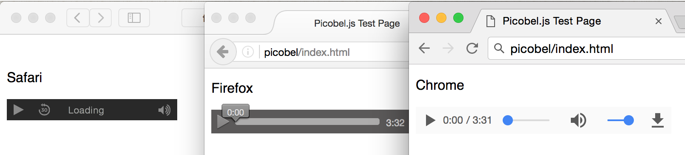
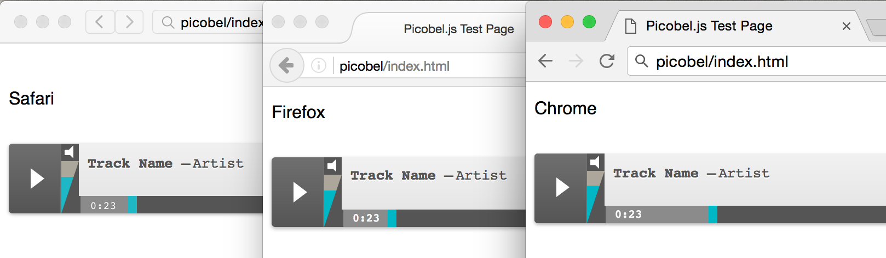
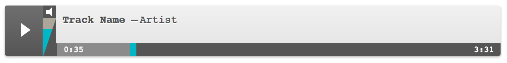
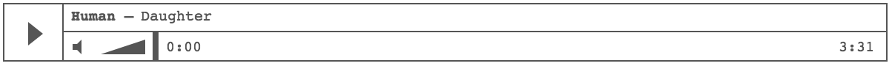

<p align="center"><a href="https://github.com/tomhazledine/picobel" target="_blank"></a></p>

<h1 align="center">Picobel.js</h1>

<p align="center">v3.0.0</p>

<p align="center"><a href="https://github.com/tomhazledine/picobel/actions/workflows/node.js.yml"></a></p>

Picobel.js (pronounced _peek-o-bell_, as in _decibel_) is a lightweight dependency-free Javascript tool that converts html audio tags into styleable markup.

* [Overview](#why-would-i-need-this)
* [Quick start](#quick-start)
* [Setting "artist" and "track name" values](#setting-artist-and-track-name-values)
* [Pre-made themes](#pre-made-themes)

## Why would I need this?

There are two reasons you might want to use Picobel:

1. You want a uniform cross-browser experience for the audio players on your site. Pick a pre-made Picobel theme, and you're all set.

2. You're frontender and CSS magician who loves to have control over every aspect the sites you create. You can use the markup-only version of Picobel, and write your own CSS.

The native html `<audio>` tag provides fantastic functionality, but gives you no styling options at all. Picobel rebuilds the audio player with regular html elements: you get all the functionality of the native audio element, _and_ complete control of it's appearance.

Using Picobel you can turn this:


_Default browser audio players_

Into this:


_Picobel-styled audio players_

**Picobel** allows you to create custom styles for your audio players: providing cross-browser consistency and a seamless integration with your existing brand styles.

## Quick start

Add Picobel to your project:

```bash
yarn add picobel
```

In your JS, initialise Picobel with your chosen class name:

```js
import picobel from "picobel";

picobel({theme: "my-awesome-audio-player"});
```

Picobel will then find any `<audio>` elements on the page and replace them with markup you can style with CSS.

## Setting "artist" and "track name" values

Applying metadata to your audio file requires adding data-attributes to your `<audio>` markup. Picobel gets the track name from the regular `title` attribute, and looks for artist information in the `data-artist` attribute. For the demo at the top of this page, the markup looks like this:

```html
<audio src="http://audio.eatenbymonsters.com/reviews/coldWarKids/lostThatEasy.mp3" title="Lost that easy" data-artist="Cold War Kids" controls>
    Your browser does not support the <code>audio</code> element.
</audio>
```

## Using premade themes

Picobel comes with several pre-made themes that you can use out-of-the-box. To use a theme, simply pass the theme name to the `picobel()` function:

```js
picobel({theme: "default"});
```

Then include the theme's CSS in your project:

```html
<link rel="stylesheet" href="path/to/picobel.default.css">
```

## Pre-made themes

Picobel comes with a few pre-made themes (for times when you don't want to style an entire audio player from scratch). To use a theme, make sure you've downloaded the correct stylesheet from the [Picobel CSS library](https://github.com/tomhazledine/picobel/tree/master/src/css) and then reference the chosen theme name as an option when you initialize Picobel in your JS.

```html
<!-- Load the theme's stylesheet -->
<link rel="stylesheet" href="path/to/picobel.default.css">

<!-- Initialise Picobel with a theme -->
<script>
    Picobel( { theme: "default" } );
</script>
```

So if you wanted to use the "iTunes" theme, your Picobel call would look like this: `Picobel({theme:"itunes"});`. If you don't explicitly choose a theme, then the Default theme will be used. The current options supported by Picobel v3 are: `skeleton` & `default`.

You can see them all in action in the [Picobel.js CodePen Collection](http://codepen.io/collection/XpZEor/), and see screenshots of each featured theme on this page:


_Default theme. [View the this theme on CodePen](http://codepen.io/tomhazledine/pen/VpNqYO)_


_Skeleton theme (use this as a jumping-off point for your own styles). [View the this theme on CodePen](http://codepen.io/tomhazledine/pen/zZXyGa)_

**Note:** several other themes were available with <=v2 of Picobel, but have been removed in v3. If you need access to these themes, you can still use Picobel v2.1.0. They will return to v3 soon along with a detailed migration guide for upgrading to v3.