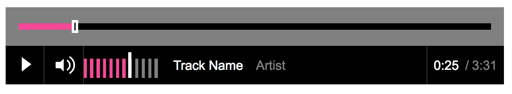
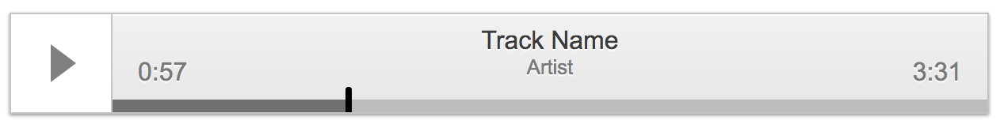
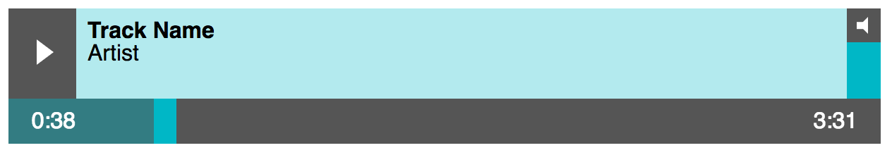

<h1 align="center">Picobel.js</h1>

Picobel.js (pronounced _peek-o-bell_, as in _decibel_) is a lightweight dependency-free Javascript tool that converts html audio tags into styleable markup.

## Why would I need this?

There are two reasons you might want to use Picobel...

1. You want a uniform cross-browser experience for the audio players on your site. Pick a pre-made Picobel theme, and you're all set.

2. You're frontender and CSS magician who loves to have control over every aspect the sites you create. You can use the markup-only version of Picobel, and write your own CSS.

The native html `<audio>` tag provides fantastic functionality, but gives you no styling options at all. Picobel rebuilds the audio player with regular html elements: you get all the functionality of the native audio element, _and_ complete control of it's appearance.

Using Picobel you can turn this:

_Default browser audio players_

Into this:

_Picobel-styled audio players_

**Picobel** allows you to create custom styles for your audio players: providing cross-browser consistency and a seamless integration with your existing brand styles.

## Installation

### Install with NPM

`npm install picobel` will install Picobel in your `node_modules` directory. Then you can include Picobel in your javascript like this:

 // Include Picobel in your project:
import Picobel from 'picobel';

    // Initialise Picobel:
    Picobel()

    // ...or initialise Picobel with your chosen options:
    Picobel({ themename: 'default' })

If you are using WebPack to bundle your scripts, you can include the stylesheet for your chosen Picobel theme here too:

    // Include the styles for *all* the themes:
    import 'picobel/css/all.css';

    // ...or include only the styles for a specific theme:
    import 'picobel/css/player.default.css';

Or alternatively you could include the stylesheets manually with a `<link>` tag in your `index.html`:

    <!-- Load the Picobel CSS -->
    <link rel='stylesheet' href='node_modules/picobel/css/player.default.css' type='text/css'/>

### Manually install

To use **Picobel.js** you'll need to include the `picobel.js` file ([found here](https://github.com/tomhazledine/picobel/blob/master/picobel.min.js)) in your project. This needs to be called before your custom scripts, and ideally in the `<footer>` of your page.

    <!-- Load Picobel -->
    

You will also need the CSS styles. Choose which "theme" you'd like to use, and load that stylesheet. All current themes can be previewed in the [Picobel.js CodePen Collection](http://codepen.io/collection/XpZEor/), and all the css files can be found in the repo, [here](https://github.com/tomhazledine/picobel/tree/master/css).

    <!-- Load the Picobel CSS -->
    <link rel='stylesheet' href='player.default.css' type='text/css'/>

Then initialize the function. For simplicity, the example below does this in an in-line `

When your page loads, Picobel will replace any default `<audio>` elements with a block of custom-markup, complete with classes that you can use to apply your custom CSS.

## Usage

If you're using a theme other than "basic", you'll need to specify the theme name in the options object when you intialise Picobel.

    Picobel( { theme: 'themename' } );

This adds a class to the container of each audio element, so if you've made your own styles you can use this to make sure your CSS is nicely namespaced.

### This:

    <audio src="http://path/to/audio/file.mp3"></audio>

### Gets turned into this:

    

        

        <button class="playerTrigger">
            play
        </button>
        

            file.mp3
            
        

        

            0:00
            

                

                

                

                <input type="range" min="0" max="100" class="songProgressSlider">
            

            3:51
        

        

            

                Volume
                10
            

            

                

                

                

                <input type="range" min="0" max="1" step="0.1" class="songVolumeSlider">
            

        

    

## Setting "artist" and "track name" values

Applying metadata to your audio file requires adding data-attributes to your `<audio>` markup. Picobel gets the track name from the regular `title` attribute, and looks for artist information in the `data-artist` attribute. For the demo at the top of this page, the markup looks like this:

    <audio src="http://audio.eatenbymonsters.com/reviews/coldWarKids/lostThatEasy.mp3" title="Lost that easy" data-artist="Cold War Kids" controls>
        Your browser does not support the <code>audio</code> element.
    </audio>

## Pre-made themes

Picobel comes with many pre-made themes. To use a theme, make sure you've downloaded the correct stylesheet from the [Picobel CSS library](https://github.com/tomhazledine/picobel/tree/master/css) and then reference the chosen themename as an option when you initialize Picobel in your JS.

    <!-- Initialise Picobel with a theme-->
    

So if you wanted to use the "iTunes" theme, your Picobel call would look like this: `Picobel({themename:"itunes"});`. If you don't explicitly choose a theme, then the Default theme will be used. The current options are: `skeleton`, `itunes`, `bbc`, `soundcloud`, `pitchfork`, & `eatenbymonsters`.

You can see them all in action in the [Picobel.js CodePen Collection](http://codepen.io/collection/XpZEor/), and see screenshots of each featured theme on this page:

_Default theme. [View the this theme on CodePen](http://codepen.io/tomhazledine/pen/VpNqYO)_

_Skeleton theme (use this as a jumping-off point for your own styles). [View the this theme on CodePen](http://codepen.io/tomhazledine/pen/zZXyGa)_

_BBC iPlayer-esque theme. [View the this theme on CodePen](http://codepen.io/tomhazledine/pen/kXZaKL)_

_iTunes-esque theme. [View the this theme on CodePen](http://codepen.io/tomhazledine/pen/NAyWQW)_

_Soundcloud-esque theme. [View the this theme on CodePen](http://codepen.io/tomhazledine/pen/VpNqjJ)_

_Pitchfork-esque theme. [View the this theme on CodePen](http://codepen.io/tomhazledine/pen/OpGrXN)_

_Eaten by Monsters theme. [View the this theme on CodePen](http://codepen.io/tomhazledine/pen/gmyZLP)_

## Contribute

This started out as a "scratch your own itch" tool for a specific project. I'm open-sourcing it in the hope it might prove useful to others too. There are _a few_ audio player tools/plugins out there, but most have too many features for my needs. I like simplicity, and I like any JS I add to my sites to be as lean as possible.

I'm hoping Picobel can be of use to as many people as possible. If you have an improvement or bug-fix or new feature, get in touch! Make a pull request on the [Picobel.js Github repo](https://github.com/tomhazledine/picobel). I'm just getting started with "open source", so I'd be very glad of any help or suggestions or advice.

---

* MIT license
* No dependencies
* v0.2.0
* Most recent release date: 20170430
